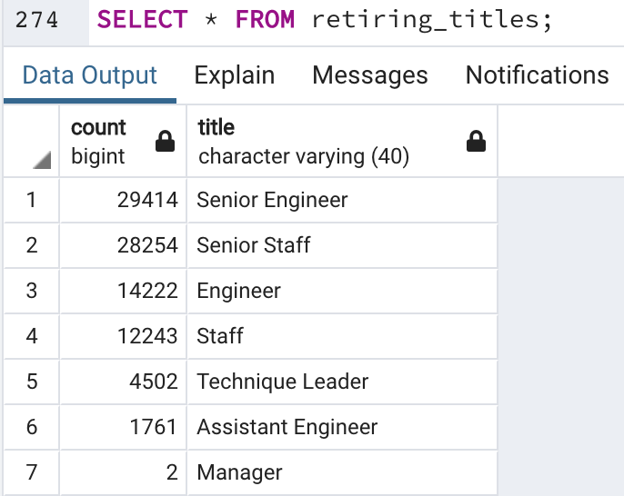
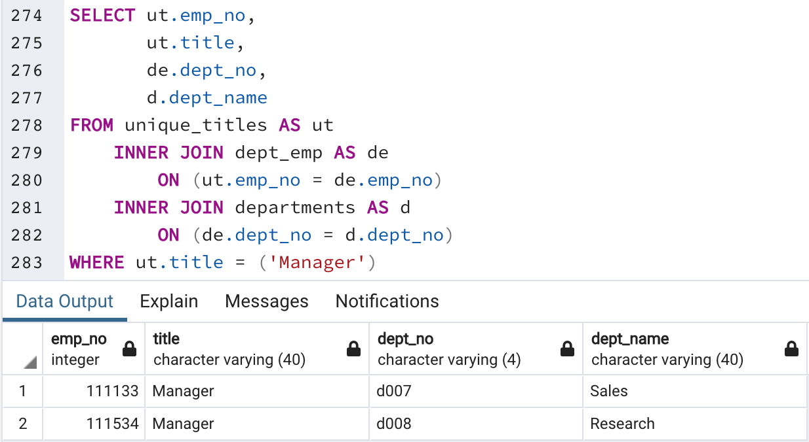
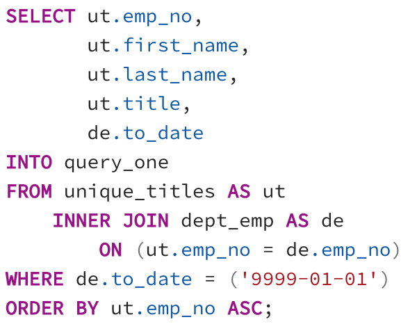
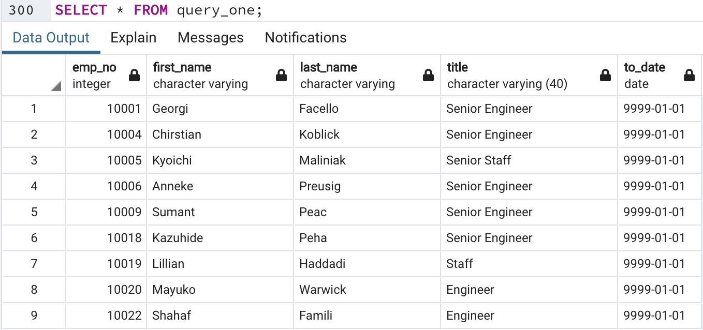
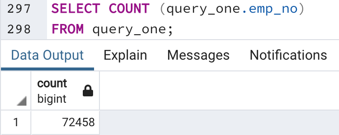

# Creating an Employee Database for Pewlett-Hackard 

## Overview of the Analysis

### Purpose 

The purpose of this analysis is to assist our client, Bobby, by creating a SQL database of all employees working at Pewlett-Hackard who are eligible for retirement to help the company's executives in their hiring plans for the near future. By compiling the six CSV files of the employees' data into a single database, we can pose queries and answer specific questions that will help determine the list of employees who will be retiring and the number of positions that would need replacements. 

The following report will summarize specific queries from our database to determine the following in the hopes of preparing Bobby's manager for the "silver tsunami":
1. the number of retiring employees per title
2. the employees who are eligible to participate in a mentorship program

## Results

### Four major points from the two deliverables

Please refer to the below figure of the retiring_titles.csv:

1. The job title with the most significant number of employees retiring soon is **Senior Engineer**, with 29,414 employees born between  January 1, 1952, to December 31, 1955, retiring. This finding should alert Bobby's manager to primarily focus on hiring new employees with the expertise to fulfill this job position. 

2. The job title with the least number of employees retiring soon is **Manager**, with two employees born between January 1, 1952, to December 31, 1955, retiring. Although this finding seems insignificant initially, it reveals that two out of the nine departments in Pewlett-Hackard will be without a manager to oversee operations. Please refer to the below screenshot of a new query that identifies the two departments without a manager after their current ones retire: Sales and Research. Bobby's manager should look into current employees in both departments to select a qualified individual to be promoted. 

	

3. It is evident by looking at the data in the retiring_titles table that for every Engineer retiring, approximately two Senior Engineers will be retiring in the same time frame. This trend also applies to the Staff and Senior Staff job titles. Within the same time frame, a significant number of Senior Engineers and Senior Staff positions will be empty in Pewlett-Hackard, which leaves a vast gap that should be a priority for the company to fill using current Engineers and Staff. 

4. There are 1549 employees from all departments eligible for the mentorship program. This number in comparison to the number of employees retiring from the company within the same time frame is very insignificant -- 1761 employees from one job title alone (Assistant Engineers) will be retiring from the company, which is greater than the number of eligible employees for the mentorship program. The company should maybe extend their eligibility requirements to allow for more employees in the program to be trained for potential promotion. 

## Summary

### How many roles will need to be filled as the "silver tsunami" begins to make an impact?

Please refer to the below screenshots of a query used to answer the above question:

This query selected for the current employees from the unique_titles.csv who have not yet retired but will be retiring soon, as evident by the '9999-01-01' in the to_date column. By joining both the unique_titles.csv with the dept_emp.csv and counting the number of unique employee numbers, we calculated that the number of roles to be filled as the "silver tsunami" begins to make an impact is 72,458. Of course, not all 72,458 employees will retire at once, but it is a significant number that should be taken into account by Bobby's managers in planning for the "silver tsunami". 

